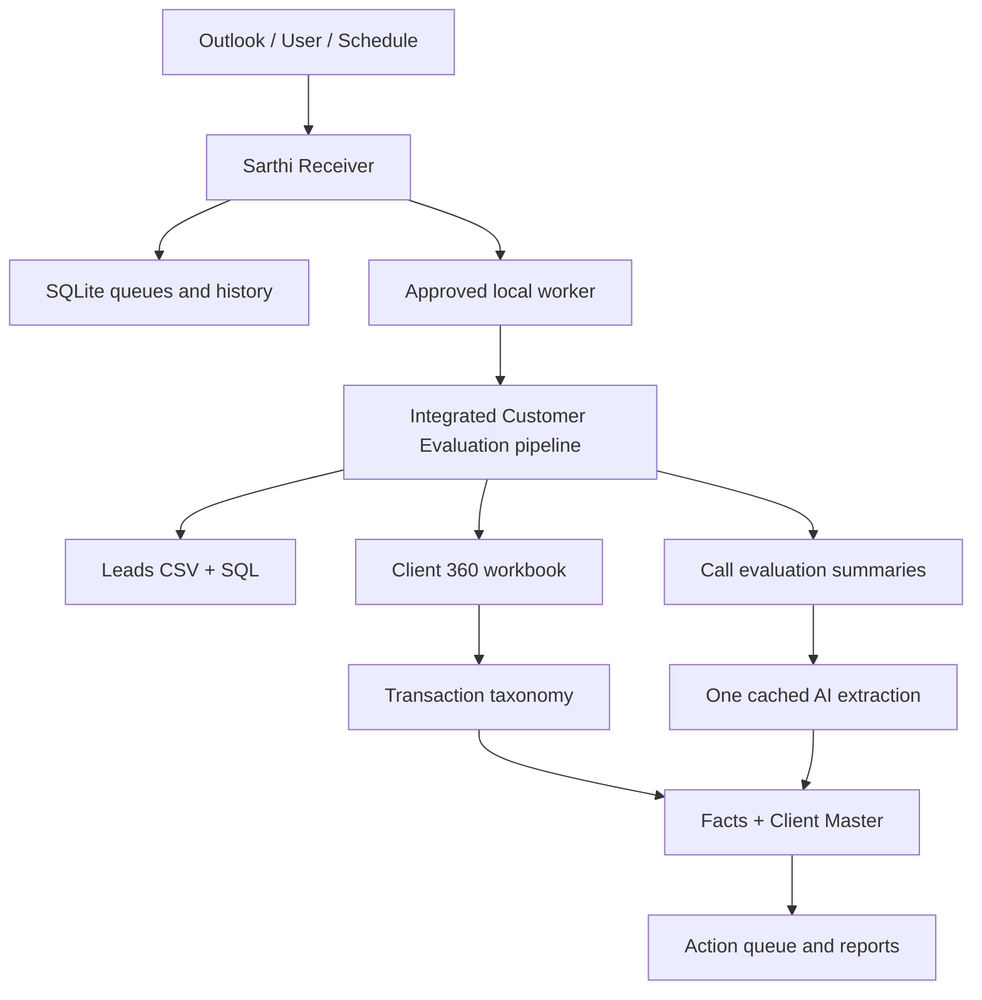

# Sarthi Receiver & Client Intelligence — Complete Project Specification

> **Status:** Living source of truth  
> **Repository:** `vikssamsung-coder/Sarthireceiver`  
> **Processing engine:** Integrated in `Sarthireceiver/client_intelligence_pipeline`
> **Last consolidated:** 31 July 2026
> **Owner:** Bigul / Sarthi  
>
> Update this document whenever a feature, data contract, taxonomy rule, path, dependency, security control, or operating procedure changes.
>
> **31 July 2026 architecture update:** The Receiver now contains the complete Phase 1 and Phase 2 Customer Final Evaluation pipeline. It uses fixed production paths, reads `Leads.csv` in place from `D:\\Sarthi\\Leads\\Leads.csv`, interprets each new/changed call once, and maintains permanent ledgers plus a unified Action Worklist.

---

## 1. Purpose

Sarthi Receiver is the local operating and automation layer for Bigul's Sarthi data-processing ecosystem. It receives files, recognizes dump types, saves and normalizes inputs, runs approved processing sequences, schedules MIS jobs, tracks execution, and now provides a controlled interface for the integrated Customer Final Evaluation pipeline.

The Client Intelligence service converts account, transaction, and call-evaluation data into client-wise facts, issues, signals, status, transaction flags, intelligence summaries, and action queues. Its optimization principle is:

> **AI interprets unstructured language once. Python rules, taxonomy, caching, and aggregation handle everything deterministic.**

The project must prevent client data, credentials, and unrestricted operating-system commands from being exposed through GitHub or the Streamlit interface.

---

## 2. Business objectives

The system is intended to help Bigul teams:

1. Track the lifecycle from lead to account opening, funding, first trade, repeat trading, revenue, retention, and win-back.
2. Identify operational, platform, order, fund, login, engagement, subscription, and behavioural issues early.
3. Convert call evaluations into structured intelligence without repeatedly sending the same content to AI.
4. Convert transaction summaries into standard, explainable flags using a versioned taxonomy.
5. Maintain one client-level intelligence master combining profile, transaction, conversation, status, issue, and action information.
6. Create team-wise action queues for RM, Dealer, Activation, Funds, Tech, Customer Care, Subscription, and other owners.
7. Preserve action history and changes in client state across runs.
8. Make long-running local processing operable from Sarthi Receiver with progress, logs, cancellation, outputs, and history.
9. Keep processing incremental so only new or changed calls need AI.
10. Maintain complete operational documentation so future development does not lose agreed features.

---

## 3. Repository responsibilities

### 3.1 Sarthireceiver

Sarthireceiver owns:

- Streamlit user interface
- dump-type registry
- recognition rules
- save folders and ordered processing steps
- Outlook/VBA intake integration
- intake queue and worker
- MIS definitions, scheduling, and history
- service management
- local settings
- GitHub self-update interface
- Client Intelligence page
- controlled Client Intelligence job registry
- detached job worker
- integrated pipeline capability detection
- fixed-path, allow-listed command construction
- bundled Client 360 and Common Call Master processing
- job logs, cancellation, history, and output downloads

### 3.2 Integrated Customer Final Evaluation pipeline

The bundled `client_intelligence_pipeline` owns:

- fixed folder initialization under `D:\Customer Final Evaluation`
- Client 360 extraction from MySQL and the fixed Leads CSV
- common evaluated-call file ingestion
- deterministic call IDs, hashes, deduplication, and corrected-call versioning
- client-wise chronological call timeline
- SQLite control state and immutable processing logs
- structured OpenAI extraction for each new or changed call, with exact duplicates skipped
- separate Markdown prompt under `client_intelligence_pipeline/prompts`, with content-hash versioning
- privacy-minimised Client 360 facts supplied as factual context for each matched call
- permanent Interest, Requirement, and Issue ledgers
- deterministic stable IDs, matching, status control, ownership, SLA, history, closure, and reopening
- full deterministic ledger replay from latest successful call versions after a correction
- the unified Action Worklist for all three source types and Excel operational output

The Streamlit screen and worker may launch only `SETUP`, `BUILD_360`,
`PROCESS_CALLS`, and `FULL`. Arbitrary script paths or command text are not
accepted from the browser.

### 3.3 Local Windows machine

The office machine provides:

- access to local `C:\` and `D:\` paths
- local MySQL access
- Outlook and OneDrive-synced content where configured
- Python runtime
- environment secrets
- source and output workbooks

GitHub stores code and documentation. It does not provide access to local drives.

---

## 4. High-level architecture



The Streamlit page launches a detached worker. The worker constructs commands only from an allow-list of modes and runs the bundled pipeline. It records status in SQLite and redirects process output to a per-job log.

---

## 5. Existing Receiver modules

| File/module | Responsibility |
|---|---|
| `app.py` | Main Streamlit navigation and screens |
| `dump_flows.py` | Dump-type registry, recognition, paths, ordered steps, run records |
| `extract.py` | Safe normalization of ZIP/CSV/XLSX inputs |
| `flow_engine.py` | End-to-end dump execution |
| `processor_integration.py` | Integration bridge to the existing email processor |
| `intake_queue.py` | Durable intake jobs |
| `intake_worker.py` | Processes queued mail/file jobs |
| `vba_generator.py` | Generates Outlook VBA watcher from configured rules |
| `mis_flows.py`, `app_mis.py`, `mis_poller.py` | MIS definitions, UI, schedules, and execution |
| `service_manager.py` | Starts, stops, restarts, and checks background services |
| `neon_sync.py` | Syncs dump-type catalog from Neon |
| `updater.py` | Updates Receiver code from GitHub over HTTPS |
| `app_client_intelligence.py` | Client Intelligence UI |
| `client_intelligence_jobs.py` | SQLite job registry |
| `client_intelligence_worker.py` | Detached evaluator process worker |
| `customer_evaluation_adapter.py` | Fixed paths, approved modes, capabilities, commands, expected outputs |
| `client_intelligence_pipeline/` | Client 360 and Common Call Master processing |

---

## 6. Receiver functional scope

### 6.1 Dump processing

Every incoming dump follows:

1. Recognize the dump type.
2. Save and normalize the file.
3. Run configured steps in order.
4. Stop or continue according to step failure policy.
5. Record results, messages, and step outcomes.

Recognition supports:

- sender
- subject
- body
- attachment name
- anywhere (subject + body)
- equals
- contains
- regex
- sender is one of
- ALL conditions inside a group
- ANY conditions inside a group
- multiple OR groups
- detect order
- enabled/disabled types
- stamped PMD labels taking priority

Input handling supports:

- ZIP extraction with path-traversal protection
- CSV placement
- XLSX placement without treating it as an ordinary ZIP
- `{assembled_path}`
- `{extract_dir}`
- `{subject}`
- `{sender_email}`
- `{batch_id}`

### 6.2 Outlook intake

The VBA generator must support:

- a reusable `InitializeInboxWatcher`
- `Application_Startup` calling initialization
- safe handling when `Item Is Nothing`
- prevention of manual execution causing runtime error 424
- EntryID-based duplicate protection
- direct attachment capture
- optional OneDrive/SharePoint link handling
- attachments-only mode
- attachment-or-link mode
- links-only mode
- locally synced OneDrive root mapping
- generated validation report
- all-in-one `ThisOutlookSession` output option

### 6.3 MIS

Receiver supports:

- configurable MIS steps
- request intake
- scheduled execution
- job/build queue
- status and history
- manual poll/run
- background service operation

### 6.4 Self-update

The Settings screen can download current source from GitHub. It must preserve:

- local SQLite database
- secrets
- local configuration
- user data and outputs

A restart is required after updating source.

---

## 7. Client Intelligence user experience

The sidebar includes **Client Intelligence**.

### 7.1 Fixed production locations

| Purpose | Fixed location |
|---|---|
| Working root | `D:\\Customer Final Evaluation` |
| Leads CSV | `D:\\Sarthi\\Leads\\Leads.csv` |
| Evaluated calls | `D:\\Customer Final Evaluation\\01_Input\\Call_Analysis` |
| Client 360 | `D:\\Customer Final Evaluation\\01_Input\\Client_360` |
| Current output | `D:\\Customer Final Evaluation\\04_Output\\Current` |

Only the Client 360 date window and maximum AI calls per run are user settings. The source paths cannot be changed from the browser.

### 7.2 Approved operations

| Internal mode | Purpose |
|---|---|
| `setup` | Create the fixed folder tree and taxonomy |
| `build_360` | Refresh Client 360 from MySQL and the fixed Leads CSV |
| `process_calls` | Ingest, deduplicate, version, interpret, reconcile, and generate outputs |
| `full` | Refresh Client 360 and then process calls |

### 7.3 Capability and cost controls

The UI reports pipeline, Leads CSV, Client 360, call-file, database-password, and OpenAI-key readiness. `OPENAI_API_KEY` enables structured extraction; without it, ingestion remains safe and intelligence stays pending. `SARTHI_AI_MODEL` may override the default model. The maximum new/changed calls per run is configurable; exact duplicates never consume AI.

### 7.4 Job lifecycle

Statuses:

```text
queued → running → success
                 → failed
                 → cancel_requested → cancelled
queued → cancel_requested → cancelled
```

Each job stores:

- ID
- mode
- status
- configuration JSON
- constructed command JSON
- PID
- created, started, and finished timestamps
- return code
- message
- log path

Jobs run outside Streamlit's rerun lifecycle. A browser refresh must not terminate a job.

### 7.5 Cancellation

Cancellation:

- marks the job `cancel_requested`
- terminates the complete Windows process tree with `taskkill /T /F`
- records `cancelled`
- keeps the log and job history

### 7.6 Outputs

The UI looks for and offers available files:

- `Sarthi_New_Client_360.xlsx`
- `Call_Fact.xlsx`
- `Issue_Fact.xlsx`
- `Client_Status_Fact.xlsx`
- `Signal_Fact.xlsx`
- `Lead_Day_Fact.xlsx`
- `Transaction_Flags.xlsx`
- `Client_Intelligence_Master.xlsx`
- `Action_Fact.xlsx`

---

## 8. New Client 360 extraction

### 8.1 Scope

The extractor creates the client-wise transaction and profile input used by the evaluator. It should focus on newly opened clients according to the configured opening-date window.

The current stable output name is:

```text
Sarthi_New_Client_360.xlsx
```

### 8.2 Required business content

Where available, the profile should include:

- Client Code
- Lead Number
- account opening date
- account age / active days since opening
- lead source
- source campaign
- campaign details
- funds collected / receipts
- current margin
- peak margin
- days since last fund
- brokerage
- last trade date
- days since last trade
- active trading days
- placed orders
- executed orders
- peak daily orders
- top symbols
- subscription purchases
- relevant transaction and product indicators

### 8.3 TPP decision

TPP subscription data is deliberately excluded from the 360 extractor.

The extractor must not contain:

- `--tpp` argument
- TPP workbook discovery
- TPP load/join logic
- TPP output columns
- TPP quality metrics
- TPP contribution to revenue

Current total revenue definition:

```text
Total Revenue = Gross Brokerage + Subscription Amount
```

### 8.4 Secrets

Database passwords must be read from the environment. For background execution, `SARTHI_DB_PASSWORD` must exist because the worker cannot answer an interactive prompt.

---

## 9. Optimized intelligence pipeline

### 9.1 Problem with the legacy design

The legacy processors can read the same source repeatedly and make separate AI calls for Call, Issue, Client Status, Signal, and Action outputs. At 4,563 calls, five fact prompts plus an action prompt could approach 27,000 AI requests.

This is slow, expensive, and difficult to maintain.

### 9.2 Required optimized flow

```text
Call evaluation summary
        ↓
One unified AI extraction for each new/changed call
        ↓
Cached structured JSON
        ↓
Python expands Call / Issue / Status / Signal facts

Client 360 transaction summary
        ↓
Versioned deterministic taxonomy
        ↓
Transaction flags and evidence

Conversation facts + transaction flags
        ↓
Lead Day Fact
        ↓
Client Intelligence Master
        ↓
Rule-based action candidates
        ↓
Selective AI only for complex actions
```

### 9.3 AI input

AI should read only useful unstructured summary fields, such as:

- Summary
- Client's Story
- Intent
- AI Disposition
- Probing & Profiling
- Further Assistance
- Product or Market Discussion

Do not send complete transaction history, every order, every fund record, or unchanged workbook columns to AI.

### 9.4 Unified AI response

A unified structured result should include:

```json
{
  "call_outcome": {},
  "client_status": {},
  "issues": [],
  "conversation_signals": [],
  "resolution_mentions": [],
  "action_context": {}
}
```

Python expands this one result into compatible fact tables.

### 9.5 Cache key

Use:

```text
Call Unique ID + content hash + prompt version + model
```

Reprocess only if:

- the call is new
- relevant content changed
- prompt version changed
- model policy requires regeneration
- an operator explicitly requests reprocessing

Store raw structured output for audit and reuse.

### 9.6 Internal storage

Preferred processing storage:

- SQLite for cache, state, and incremental tracking
- Parquet for large intermediate tables where appropriate
- Excel only for user-facing outputs

Avoid rewriting all Excel outputs after every individual call. Write in batches.

---

## 10. Transaction taxonomy

Transaction data uses deterministic rules, not AI. Every flag must be explainable and evidence-backed.

### 10.1 Standard flag schema

Each flag should contain:

- Flag Code
- Client Code
- Lead Number
- Flag Category
- Flag Name
- Rule Version
- Trigger Value
- Threshold
- Severity
- Evidence
- Detected Date
- First Detected Date
- Last Detected Date
- Current State
- Resolution Date where applicable

### 10.2 Core taxonomy

| Category | Flag | Example rule |
|---|---|---|
| Activation | Funded Not Traded | Funds/margin > 0 and executed trades = 0 beyond threshold |
| Engagement | No Trade Recently | Days since last trade exceeds segment threshold |
| Orders | Placed Not Executed | Placed orders > 0 and executed orders = 0 |
| Orders | Order Rejection Pattern | Rejected orders exceed threshold or repeat across days |
| Funds | Fund Attempt Failed | Fund attempt detected but receipt/credit remains 0 |
| Login | Funded Not Logged In | Funded client has no login after funding |
| Margin | High Idle Margin | Material current margin and no recent trading |
| Margin | Margin Declining | Current margin materially below peak/recent baseline |
| Withdrawal | Funds Withdrawn | Net withdrawal or sharp margin reduction |
| Retention | Trading Frequency Falling | Recent active days below comparable prior period |
| Revenue | Brokerage Declining | Current-period brokerage below prior baseline |
| Behaviour | Peak Activity Dropped | Current orders materially below peak daily orders |
| Subscription | Renewal Due | Plan expiry falls within configured window |
| Subscription | Subscription Not Utilized | Active/paid subscription with insufficient usage |
| Opportunity | Funded Low Activity | Funded client trading materially below expected activity |

Thresholds must be configurable and versioned. A taxonomy change must not silently reinterpret historical results without a rule-version change.

---

## 11. Fact-table contracts

### 11.1 Call Fact

One row per evaluated call, including:

- Call Unique ID
- Lead Number
- Client Code where available
- call date/time
- agent/RM
- duration
- summary
- outcome/disposition
- intent
- contact result
- content hash
- prompt version
- processed timestamp

### 11.2 Issue Fact

One row per issue per call:

- Issue ID
- Call Unique ID
- Lead Number
- Client Code
- issue category/subcategory
- issue statement
- severity
- evidence
- detected date
- recurrence
- resolution status

A client with three issues must have three Issue Fact rows, not three issue columns.

### 11.3 Client Status Fact

One row per status observation:

- Lead Number / Client Code
- observation date/time
- risk level
- mood/sentiment stage
- satisfaction state
- engagement state
- intent/readiness
- reason and evidence
- source call

This preserves changes such as Risk → Neutral → Happy.

### 11.4 Signal Fact

One row per signal:

- signal code
- signal family
- direction
- severity
- confidence
- evidence
- source type
- source ID
- first/last detected dates
- active/resolved state

Signals may be conversational or transactional, but their provenance must remain explicit.

### 11.5 Lead Day Fact

One row per Lead Number per date. It summarizes:

- call counts and outcomes
- issues opened/resolved
- latest status
- signals triggered
- transaction activity
- funds/margin
- orders/trades
- brokerage
- action demand
- no-activity/change indicators

This is the daily monitoring layer.

### 11.6 Client Intelligence Master

One current-state row per client/lead, combining:

- identity and source
- account-opening data
- transaction summary
- current and peak values
- recency/frequency measures
- current issues
- current status
- active signals
- transaction flags
- last interaction
- current priority
- recommended owner
- current action
- next follow-up date

The master is a current-state table. History belongs in fact/history tables.

### 11.7 Action Fact

The operational workbook should contain:

#### Action Register

Current open/reopened actions:

- Action ID
- Lead Number
- Client Code
- originating issue/signal/flag IDs
- priority and severity
- owning team
- action objective
- recommended action
- due date
- current status
- assigned user
- last update
- evidence/context

#### Action History

Immutable events:

- creation
- assignment
- update
- follow-up
- resolution
- closure
- reopening
- escalation

Routine actions should come from mapping rules. AI should enrich only complex cases involving conflicting issues, frustration, repeated failure, or context-sensitive action planning.

---

## 12. Action ownership examples

| Trigger | Default team | Default objective |
|---|---|---|
| Funded Not Traded | Activation / RM | Assist client to complete the first trade |
| Placed Not Executed | Dealer / Tech | Diagnose order status or rejection reason |
| Funds Not Reflected | Funds Team | Verify payment/ledger status and contact client |
| No Trade Recently | RM | Understand inactivity and reactivate |
| High Idle Margin | RM / Dealer | Understand intent and offer relevant assistance |
| Renewal Due | Subscription Team | Explain utilization and renewal value |
| Mobile App Functional Issue | Tech / Product | Reproduce, classify, and resolve app issue |
| Repeated Unresolved Issue | Customer Care Lead | Escalate with full interaction history |

Assignments must remain configurable; the table above defines defaults, not permanent organization policy.

---

## 13. Security and privacy

Mandatory controls:

1. Never commit client workbooks, transcripts, API keys, SQL passwords, access tokens, generated reports, SQLite caches, or logs.
2. Use environment variables for `SARTHI_DB_PASSWORD`, `OPENAI_API_KEY`, and other secrets.
3. Restrict evaluator execution to approved operation IDs.
4. Do not accept arbitrary scripts, shell commands, or unrestricted paths from a remote browser.
5. Prefer allow-listed base folders and validate that configured paths remain inside them.
6. Keep Receiver and Evaluator checkouts separate.
7. Run the worker under a dedicated Windows user where practical.
8. Log who/what started a job when authentication is introduced.
9. Return client-level outputs only to authorized users.
10. Preserve a processing audit trail: input identity/hash, code version, prompt version, rule version, timestamps, and outcome.
11. Protect logs from containing secrets or unnecessary raw client data.
12. Keep GitHub private and grant least-privilege repository access.

---

## 14. Installation and configuration

### 14.1 Local folders

Recommended:

```text
C:\Users\Vikrant.Dale\Downloads\Sarthi\Sarthireceiver
C:\Users\Vikrant.Dale\Downloads\Sarthi\Sarthi_Evaluator
```

### 14.2 Environment variables

At minimum:

```text
SARTHI_DB_PASSWORD
OPENAI_API_KEY
```

Other SQL connection settings should also be environment-based or stored in a non-committed local configuration.

### 14.3 Dependencies

Receiver currently requires packages including:

- streamlit
- pandas
- openpyxl
- psutil
- psycopg
- pywin32 on Windows
- openai
- pydantic

### 14.4 Update procedure

1. In Receiver, use **Settings → Update now** or pull the repository manually.
2. Restart Streamlit.
3. Update/pull `Sarthi_Evaluator` separately.
4. Install any changed requirements.
5. Open Client Intelligence.
6. confirm capability status and paths.
7. Run Validate before Test or Full after a material update.

---

## 15. Operating procedure

### First setup

1. Clone/update both repositories.
2. Install both requirement sets.
3. Set environment variables.
4. Start Receiver.
5. Save Client Intelligence paths.
6. Confirm extractor and pipeline status.
7. Run Build New Client 360.
8. Run Validate.
9. Run Test with five calls.
10. Review logs and output schemas.
11. Run Full Intelligence.

### Routine run

1. Ensure source files are closed in Excel.
2. Update code if required.
3. Build/refresh Client 360.
4. Validate.
5. Run Full Intelligence.
6. Review job success and duration.
7. Check new AI vs cached counts.
8. Review transaction-flag totals.
9. Verify Master and Action outputs.
10. Assign and track operational actions.

### Failure recovery

- Read the job log.
- Correct the missing path, environment variable, workbook lock, dependency, or source schema.
- Use Test before retrying Full when the fix affects processing.
- Do not delete cache merely to bypass an error.
- Preserve failed job history.
- Resume safely where the evaluator supports it.

---

## 16. Testing and acceptance criteria

### 16.1 Receiver regression

A release should verify:

- app imports
- SQLite initialization and migration
- dump recognition
- ZIP/CSV/XLSX handling
- intake queue
- VBA generator
- MIS flows
- service manager
- updater exclusions
- Client Intelligence page import
- job creation
- worker start
- success/failure transitions
- cancellation
- capability detection
- command allow-list
- output discovery

### 16.2 Evaluator acceptance

Verify:

- Client 360 builds without TPP
- `Lead Number` remains available
- only required transaction columns are read
- unified AI extraction is one call per new/changed call
- cache hits do not create AI calls
- facts expand locally
- taxonomy uses no AI
- flags include rule evidence/version
- Master includes unmatched 360 leads
- outputs preserve agreed column contracts
- action history is not overwritten
- a repeated run is incremental and does not create duplicates

### 16.3 Performance measures

Track:

- total source calls
- matched leads
- new/changed calls
- cache hits
- AI requests
- AI failures/retries
- transaction rows/columns read
- flags generated
- clients with open issues
- duration per stage
- total duration
- output row counts
- memory use where practical

The optimization target is one initial AI call per eligible call summary and zero AI calls for unchanged calls, transaction taxonomy, routine aggregation, and routine actions.

---

## 17. Current implementation status

### Phase 1 — implemented and regression-tested

- fixed folder initialization under `D:\\Customer Final Evaluation`
- fixed Leads CSV read-in-place
- Sarthi Client 360 refresh
- common call standardization
- stable call IDs and full-row/content hashes
- exact duplicate skip
- unchanged source-file skip on later pipeline runs
- corrected-call versioning
- collision review
- client matching and unmatched routing
- automatic upgrade of previously unmatched calls after a later Client 360 refresh
- client-wise chronological timeline
- SQLite persistence and processing audit
- current and archived Excel workbooks

### Phase 2 — implemented and regression-tested

- one schema-valid structured extraction per new or changed call
- relevant funds, margin, trade, order, brokerage, and subscription facts in the AI context
- prompt-version upgrade and retry without discarding the last successful extraction
- prompt text maintained separately in Markdown rather than embedded in Python
- permanent Interest, Requirement, and Issue ledgers
- deterministic stable IDs and client/category/product/description reconciliation
- lead-only records upgraded to Client Code without creating duplicate ledgers
- corrected-call replay so superseded intelligence is removed from current ledgers
- immutable ledger history
- one unified Action Worklist covering interests, requirements, and issues
- default ownership, priority, SLA date, overdue state, and escalation
- issue repeat count and reopening
- resolution pending confirmation
- final closure only after client confirmation or system validation
- AI cannot author system validation; that signal is reserved for deterministic transaction rules
- AI extraction audit with model, prompt version, input hash, status, and error
- run-level AI limit and ingestion-only operation when no key is available

### Current workbook

`Sarthi_Client_Intelligence_Current.xlsx` contains Management Summary, Action Worklist, Client Call Timeline, Common Call Master, Processing Log, all three ledgers, Ledger History, Closed Actions, Client 360, duplicate/unmatched/error reviews, Taxonomy Master, AI Extraction Audit, and Call Versions Audit.

## 18. Recommended next phases

### Phase 3 — transaction validation and Client 360 enrichment

- validate issue resolution from funds, orders, login, segment, and subscription data
- populate transaction context in every action
- enrich Client 360 with active interest, open requirement, open issue, overdue action, priority, and next-action fields
- add configurable transaction taxonomy rules and versions

### Phase 4 — operational action updates

- controlled team updates for assignment, attempts, action taken, outcome, and evidence
- immutable Action History
- role-based access and initiating-user audit
- team-wise worklist exports and dashboards

### Phase 5 — management analytics

- issue recurrence and SLA trends
- interest conversion and requirement fulfilment
- action effectiveness against activation, trading, retention, and revenue
- taxonomy review and false-positive workflow

## 19. Feature-control checklist

Every future change should answer:

- Does it change a source file or database contract?
- Does it add or rename an output column?
- Does it use AI where deterministic logic is possible?
- Does it change prompt/model/cache identity?
- Does it change taxonomy or thresholds?
- Does it change action ownership or severity?
- Does it expose a new local path or command?
- Does it require a new environment variable?
- Does it affect incremental processing?
- Does it affect historical comparability?
- Does it require a database migration?
- Does it require coordinated Receiver UI, worker, and pipeline changes?
- Has README and this document been updated?
- Have regression and end-to-end tests passed?

---

## 20. Definition of done

A Client Intelligence feature is complete only when:

1. Code is committed to the correct repository.
2. Receiver UI, worker, and bundled pipeline compatibility is verified.
3. No secrets or client data are committed.
4. Input and output contracts are documented.
5. Deterministic work is not unnecessarily delegated to AI.
6. Incremental/cache behavior is verified.
7. Failure and cancellation behavior is safe.
8. Relevant tests pass.
9. User operating instructions are updated.
10. This specification's status/roadmap is updated.

---

## 21. Change log

| Date | Change |
|---|---|
| 2026-07-27 | Consolidated Receiver, Evaluator integration, Client 360, TPP exclusion, optimized architecture, taxonomy, facts, actions, security, operations, testing, status, and roadmap into one source-of-truth document. |
